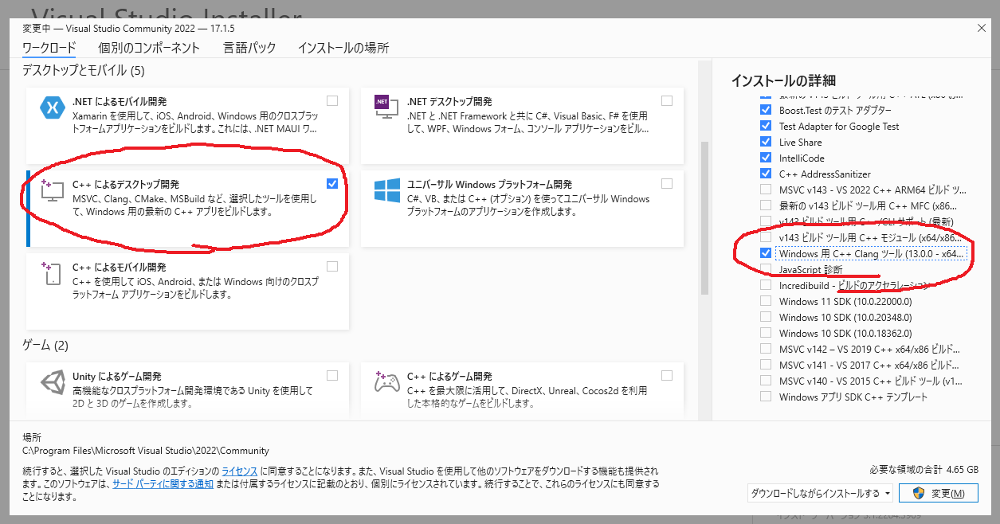

# PaxOS 8

**PaxOS 8** is the latest version of **PaxOS**, a lightweight operating system for PaxoPhones. 

## what's new ?

It brings a very reliable event system allowing a very fluid use of the device. Its new graphic module adds new, more aesthetic widgets in a precise theme designed on figma!

The homepage features 8 simplistic apps but none too many:

- The phone app for making calls
- The message app, to send bubble messages to contacts
- The contacts app, which allows you to add and delete contacts that can be used in other applications
- The Calculator
- The Clock, which will allows you to program alarms and launch stopwatches and timers
- The Map to calculate its GPS coordinates
- The Snake
- The game 2048

Many improvements are coming soon.

Feel free to suggest contributions.

See more on [paxo.fr](https://www.paxo.fr)

### Windows Build Instructions

Before getting started, you need an IDE, a Visual Studio License (Community Edition is enough) and know how to setup a CMake project with custom toolchain.

1. Install Visual Studio Community or Visual Studio Build Tools with CLang

2. Setup your favorite IDE (eg. CLion) with CLang (very important ! not compatible with MSVC or MinGW)

3. Setup CMake using Ninja (recommended)

4. You shouldn't have to install any library (everything is included)

### macOS Build Instructions (using Xcode)

1. Clone the repository and access the dir.
2. `cmake -G Xcode`
3. You can open the .xcodeproj directly in Xcode, to edit PaxOS's files you'll need to drag the folders `app`, `extensions`, `interface`, `lib`, `ressources`, `storage`, `tasks` and `widgets` to the project.

Troubleshooting:
- If you get the message `ld: warning: ignoring file /opt/homebrew/Cellar/sdl2/2.28.2/lib/libSDL2-2.0.0.dylib': found architecture 'arm64', required architecture 'x86_64'` followed by an error you can do:
  1. `cp lib/SDL2-2.28.2/libSDL2-2.0.0-2.dylib /opt/homebrew/Cellar/sdl2/2.28.2/lib/libSDL2-2.0.0.dylib`
  2. Disable the quarantine for the file: `xattr -dr com.apple.quarantine /opt/homebrew/Cellar/sdl2/2.28.2/lib/libSDL2-2.0.0.dylib` 
